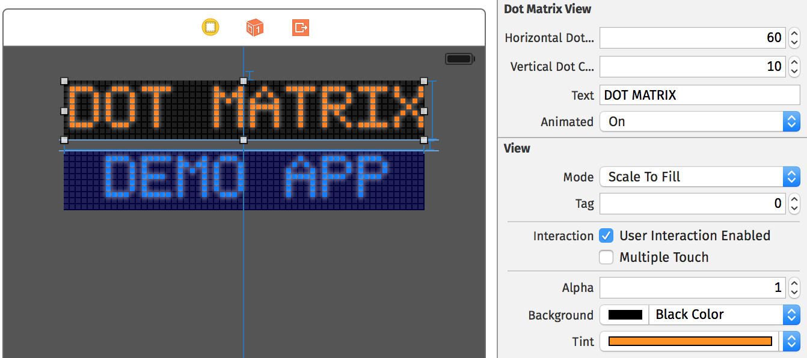

CKDotMatrixView
===============

Looking for a highly customizable animated banner-like dot matrix view? Got it!

It's almost as easy to handle as a `UILabel`.

To see the demo app in action, clone this repo, navigate to the `DotMatrixDemo` folder and run `pod install`. Open the created workspace in Xcode and you are ready to go.

## Features

* Can be adjusted to fit almost any size using storyboard settings only.
* Uses color information provided in the storyboard.
* Provides some basic animation (to be optimized and extended...)
* Displays a cool glowing around the illuminated dots.
* Comes with one 10 dot font providing numbers and upper case fonts (to be extended...) 

## Usage

As you can see in the provided demo app, the CKDotMatrixView can be added to your app's UI without a single line of code (there's no view controller implementation in that demo app).

Add a `UIView` to your storyboard and set its origin and size appropriately.

Head to the _identity inspector_ and add the following _user defined runtime attributes_:
* `horizontalDotCount` - number of dots displayed horizontally (mandatory)
* `verticalDotCount` - number of dots displayed vertically (mandatory)
* `text` - the string to be displayed by the dot matrix (optional, can be used for static content)
* `animated` - a flag indicating, wether the content should be initially animated (optional, default is `NO`)

Go to the _attributes inspector_ and set the background color and the tint color as you like. The illuminated dots will be drawn using the tint color and the dots that are off will be drawn using a slightly lighter color than the background color.

If you want to set the text programmatically simply set the `text` property of the `CKDotMatrixView` instance.

You can create your own dot font by providing your own `CKDotMatrixFontMapping` and setting it to the `fontMapping` property of the `CKDotMatrixView` instance.

## Author

Christian Klaproth, [@JaNd3r](http://twitter.com/JaNd3r)

## License

`CKDotMatrixView` is available under the MIT license. See the LICENSE file for more info.
